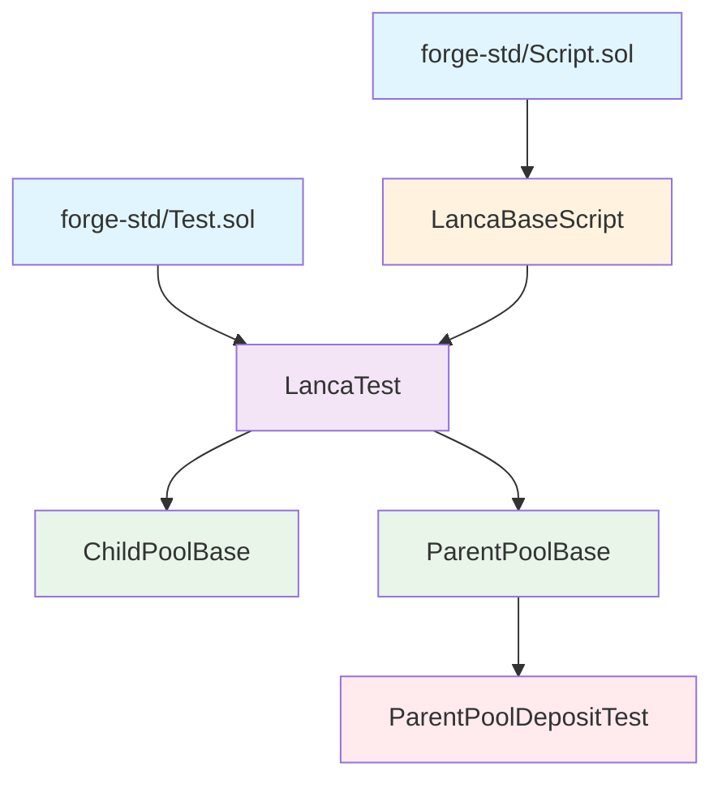

# Foundry Test Module Inheritance Diagram

## Inheritance Structure



## Module Descriptions

- **LancaBaseScript**: Deployment config, test addresses, constants
- **LancaTest**: Combined base with deployment + testing utilities
- **ChildPoolBase**: ChildPool setup, rebalancer utilities, deficit/surplus helpers
- **ParentPoolBase**: ParentPool setup, deposit/withdrawal queue management
- **ParentPoolDepositTest**: Concrete tests for deposit functionality

## Usage
```bash
make test args="-vvvvv"
```
