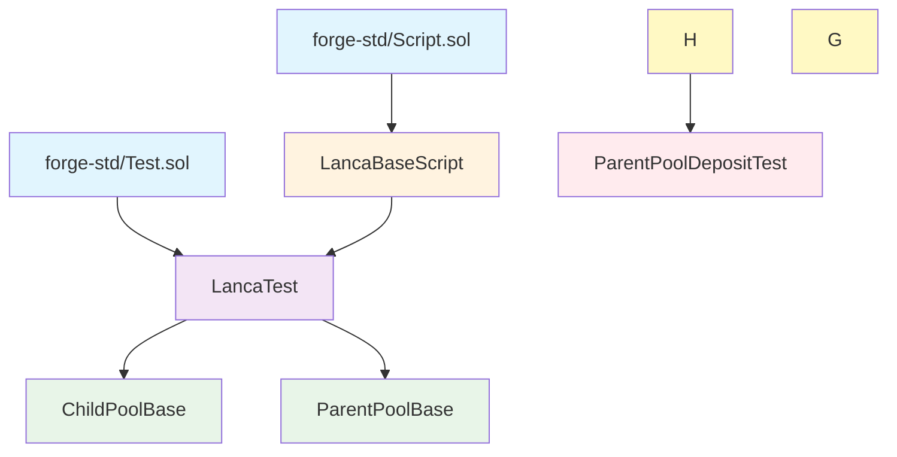

# Foundry Test Module Inheritance Diagram

## Inheritance Structure

## Module Descriptions

- **LancaBaseScript**: Deployment config, test addresses, constants
- **LancaTest**: Combined base with deployment + testing utilities
- **ChildPoolBase**: ChildPool setup, rebalancer utilities, deficit/surplus helpers
- **ParentPoolBase**: ParentPool setup, deposit/withdrawal queue management
- **ParentPoolDepositTest**: Concrete tests for deposit functionality

## Key Features

- Multiple inheritance pattern (LancaTest extends both Script and Test)
- Layered setUp() chain with super.setUp() calls
- Specialized utilities at each level
- Helper functions for common operations
- Event capture and queue ID tracking
